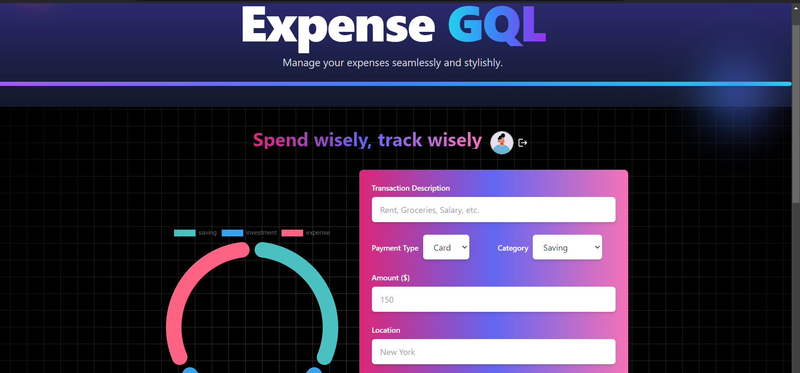

### Expense Tracker README.md



```markdown
# Expense Tracker

A **full-stack expense tracker application** designed to help users manage their transactions efficiently. This project incorporates robust backend functionality and an interactive frontend to provide a seamless experience for users.

## Features

### Backend
- **Authentication**: User login and registration using `Passport.js`.
- **GraphQL API**: Developed using `@apollo/server` to handle queries and mutations.
- **Database**: Data persistence with `MongoDB`, managed through `Mongoose`.
- **Error Handling**: Enhanced error reporting with `http-errors`.
- **Development Tools**: Nodemon for live server reload during development.

### Frontend
- **UI Framework**: React with TypeScript for type safety and scalability.
- **State Management**: Redux Toolkit for managing global state.
- **Styling**: Tailwind CSS for utility-first, responsive design.
- **Animations**: Framer Motion for smooth transitions and animations.
- **Dynamic Components**:
  - **Transaction History**: Displays user transactions in a responsive grid layout.
  - **Detailed Cards**: Each transaction has a card with detailed information.
  - **Fallback UI**: Elegant "No transactions found" message when no data is available.


## Tech Stack

### Backend
- **Node.js**
- **Express**
- **GraphQL**
- **MongoDB**


### Frontend
- **React**
- **TypeScript**
- **Tailwind CSS**
- **Redux Toolkit**
- **Framer Motion**

### Development Tools
- **Nodemon**
- **dotenv**


---

## Getting Started

### Prerequisites
Ensure you have the following installed:
- **Node.js** (v18 or later)
- **npm** or **yarn**
- **MongoDB** (local or remote instance)

### Installation
1. Clone the repository:
   ```bash
   git clone git@github.com:sandip95-web/Expense-Tracker.git
   cd expense-tracker
   ```

2. Install backend dependencies:
   ```bash
   npm install
   ```

3. Install frontend dependencies:
   ```bash
   cd frontend
   npm install
   cd ..
   ```

4. Create a `.env` file in the root directory and configure the following:
   ```env
   PORT=5000
   MONGO_CONNECTION_STRINGI=<your_mongodb_connection_string>
   NODE_ENV=<your_node_env>
   SESSION_SECRET=<your_secret_key>
   

---

## Running the Application

### Development Mode
To start the application in development mode:
```bash
npm run dev
```
This will use `nodemon` for hot-reloading.


